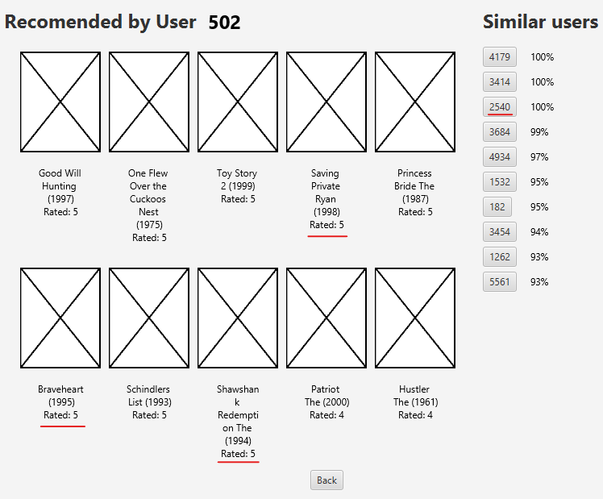
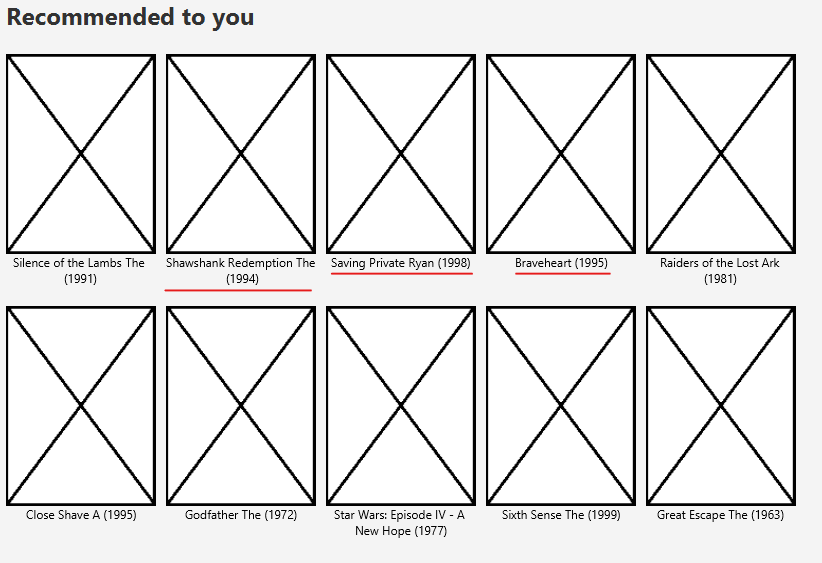
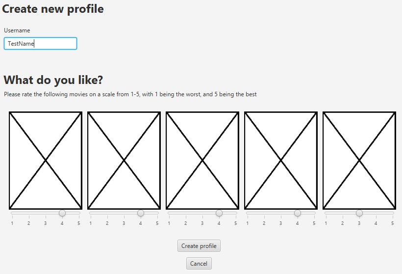

# Optimization Of Movie Recommendations In A Social Context
A project on 2nd semester looking at making movie recommendations and showing them in a graphical user interface. The project was created using Java 11 for the recommendation part and JavaFX for the GUI, which was chosen to follow the "Object Oriented Programming" course covering Java and JavaFX.

The recommendations are made by using a combination of the lazy learner k-Nearest Neighbor and an Artificial Neural Network. The k-NN model uses a collaborative approach meaning that it makes predictions of what users will like based on what users similar to him like. The ANN uses a content-based approach meaning that it makes predictions based on what a user likes in isolation, independently of what others like. The prediction error of the combined model is 0.71 Mean Absolute Error(MAE), which refers to how wrong the predictions of ratings are.

## Running the application
To run the code you will need to download JavaFX 11 SDK as it is seperated from the JDK since java 11. You have to unpack the JavaFX SDK and make the lib folder inside into library for your project. When this is setup you should be able to compile and run the src/Main.java file as usual.

## Movie Recommendations and User Profile
The image below shows some of the movies user 502 has rated the highest. On the right the users most similar to user 502 are highlighted, and we look at user 2540 more in depth in the second image where some of the movies that are recommended to him are movies that are rated highly by its most similar user 502:

## User creation concept
The following image is a page illustrating a concept of what was planned to be a way for users to create a profile and rate some movies to avoid the cold start problem of the recommender system:

